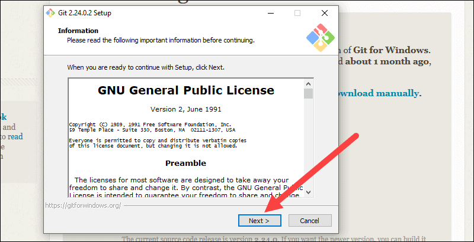
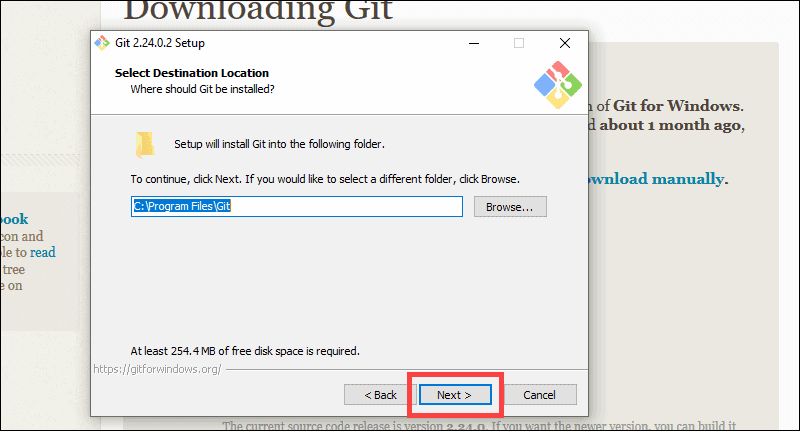
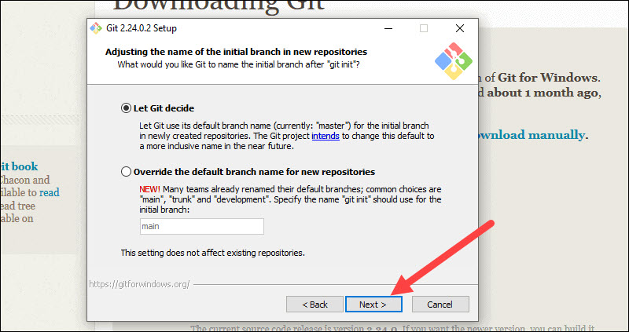
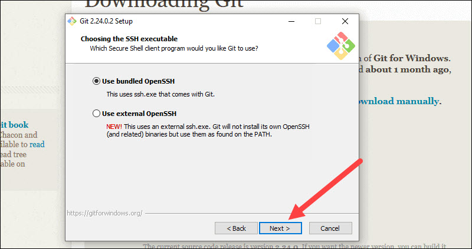
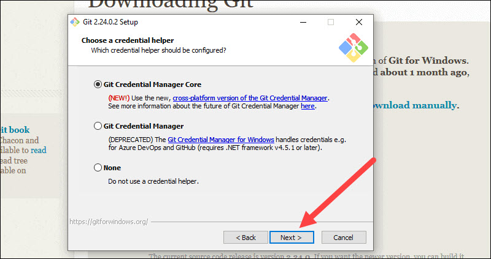

# Installing Git

Before you start using Git, you have to download it to your computer.

You can download it from the link: 
<https://git-scm.com/downloads>

1. Review the GNU General Public License, and when you’re ready to install, click Next.

 

2. The installer will ask you for an installation location. Leave the default, unless you have reason to change it, and click Next.

 

3. A component selection screen will appear. Leave the defaults unless you have a specific need to change them and click Next.

 

4. The installer will offer to create a start menu folder. Simply click Next.

 

5. Select a text editor you’d like to use with Git. Use the drop-down menu to select Notepad++ (or whichever text editor you prefer) and click Next.

 

6. The next step allows you to choose a different name for your initial branch. The default is 'master.' Unless you're working in a team that requires a different name, leave the default option and click Next.

 

7. This installation step allows you to change the PATH environment. The PATH is the default set of directories included when you run a command from the command line. Leave this on the middle (recommended) selection and click Next.

 

8. The installer now asks which SSH client you want Git to use. Git already comes with its own SSH client, so if you don't need a specific one, leave the default option and click Next.

 

9. The next option relates to server certificates. Most users should use the default. If you’re working in an Active Directory environment, you may need to switch to Windows Store certificates. Click Next.

 
 
10. The next selection converts line endings. It is recommended that you leave the default selection. This relates to the way data is formatted and changing this option may cause problems. Click Next.

 

11. Choose the terminal emulator you want to use. The default MinTTY is recommended, for its features. Click Next.

 

12. The installer now asks what the git pull command should do. The default option is recommended unless you specifically need to change its behavior. Click Next to continue with the installation.

 

13. Next you should choose which credential helper to use. Git uses credential helpers to fetch or save credentials. Leave the default option as it is the most stable one, and click Next.

 

14. The default options are recommended, however this step allows you to decide which extra option you would like to enable. If you use symbolic links, which are like shortcuts for the command line, tick the box. Click Next.

 

15. Depending on the version of Git you’re installing, it may offer to install experimental features. At the time this article was written, the options to include support for pseudo controls and a built-in file system monitor were offered. Unless you are feeling adventurous, leave them unchecked and click Install.

 
16. Once the installation is complete click Finish.
